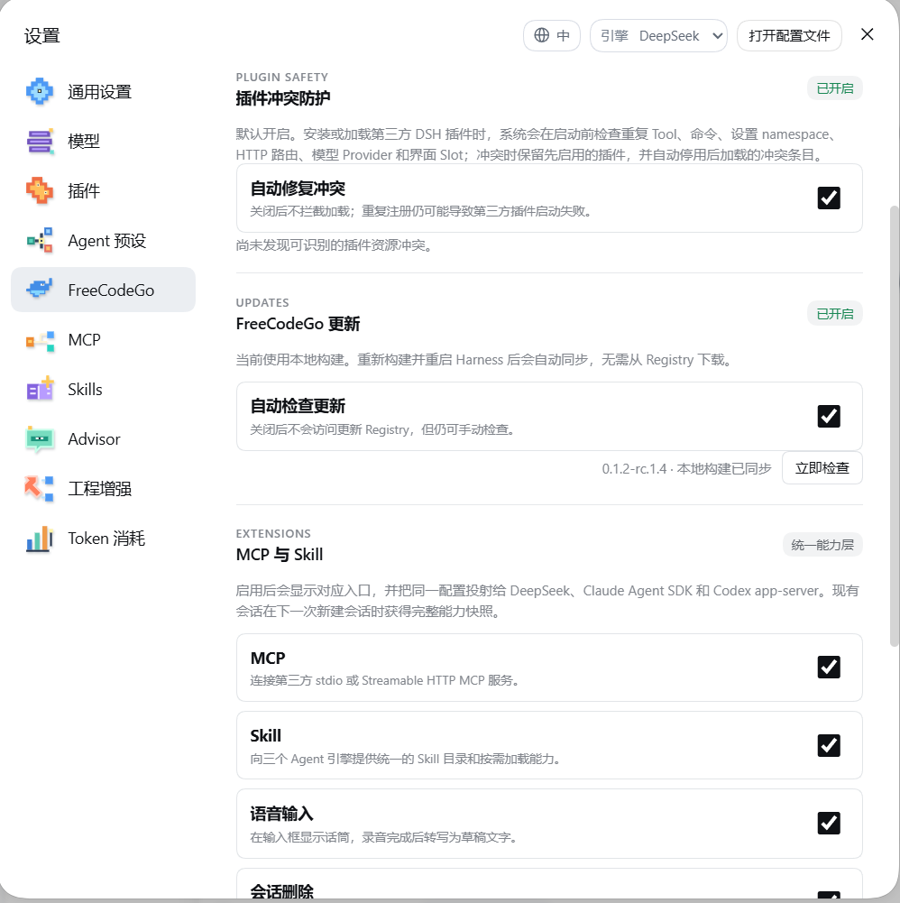

# FreeCodeGo Harness Plugin

FreeCodeGo 是面向 DeepSeek Harness 的预编译扩展，为 Harness 增加多提供商模型路由、账号管理、Codex/Claude 原生 Agent 引擎、工程协作工具和社区插件能力。

本仓库仅提供发行说明、用户文档和问题追踪，不包含 FreeCodeGo 私有源代码。运行文件以一个公开 npm 包发布：[`freecodego`](https://www.npmjs.com/package/freecodego)。

## 当前安装状态

当前公开插件为 `freecodego@0.1.3-alpha.1`，它仅兼容 DeepSeek Harness `0.1.3-alpha.1`。

**目前没有可供普通用户直接安装的、与该版本兼容的 Harness CLI 或 Desktop 发行版。** npm 上现有的 `@deepseek-ai/dsh@0.1.2-rc.1` 是旧 CLI，不能安装或运行当前 FreeCodeGo 插件。请不要执行 `npm install --global @deepseek-ai/dsh` 后尝试安装本插件。

普通用户应等待后续发布的 FreeCodeGo Desktop 或 Harness `0.1.3-alpha.1` CLI 发行版。届时会在本仓库提供对应下载地址和一条可直接执行的安装命令。

### 开发者预览：从 Harness 源码构建

开发者可从 [DeepSeek Harness 源码仓库](https://github.com/deepseek-ai/deepseek-harness) 构建与插件版本对应的 Harness，再安装 FreeCodeGo：

```powershell
git clone --branch dsh-v0.1.3-alpha.1 https://github.com/deepseek-ai/deepseek-harness.git
cd deepseek-harness
corepack enable
pnpm install
pnpm run build
pnpm dsh plugin --profile web add --save-exact freecodego@0.1.3-alpha.1
pnpm dsh web
```

此流程面向开发者，要求本机具备 Node.js `22.19.0` 或更高版本以及 pnpm。源码构建后的 `pnpm dsh` 是项目本地 CLI，不需要、也不应依赖旧 npm CLI。

### Desktop 兼容性

- 已发布的旧 Desktop 内置 Harness `0.1.2-alpha.1`，不能安装当前插件。
- 只有未来已明确标注支持 Harness `0.1.3-alpha.1` 的 Desktop 才能安装 `freecodego@0.1.3-alpha.1`。
- Web 与 Desktop 只有在使用相同 `DSH_HOME` 和相同 Profile 时才会读取同一份插件数据。

## 界面预览

以下为 FreeCodeGo 插件真实界面截图。截图中的账号、密钥和模型可用状态均由本地 Harness Host 管理，不公开私有源代码或凭据。

### 账号与提供商


神秘工作室、B.AI、OpenRouter 等 Provider 的账号状态、Key 配置和模型可用性统一在插件内管理。

### 模型选择器


模型按 Provider 分组收纳，支持展开、免费/倍率标识、连接方式提示和当前会话模型切换。

### 插件安全与更新



内置第三方插件冲突保护、MCP/Skill/语音/会话能力开关，以及 `latest`、`next`、`canary` 更新通道。

### 社区 MCP 市场


可从 FreeCodeGo 社区页浏览 MCP、Skills 和插件目录，通过 Harness Host 一键添加。

### 工程增强


工程 Skills、项目长期记忆、代码结构图、实施后验证与多角色方案审查均可按需启用。

## 下载地址

- npm：[`freecodego`](https://www.npmjs.com/package/freecodego)
- 当前版本：[0.1.3-alpha.1](https://www.npmjs.com/package/freecodego/v/0.1.3-alpha.1)
- npm tarball：`https://registry.npmjs.org/freecodego/-/freecodego-0.1.3-alpha.1.tgz`

## 包含内容

单一 npm 成品包包含完整的 FreeCodeGo Harness 组成：

- Host 插件和 Cordis profile patch
- Web Client 设置界面
- Session Events 注册模块
- Codex 原生 Worker
- Claude 原生 Worker
- 运行时健康检查、模型路由和账号 Remote
- 编译后的生产代码、README 和许可证

npm 包不包含 `src/`、测试文件或 source map。编译后的 JavaScript 仍然属于可检查的客户端代码，不应被视为加密或 DRM 保护。

## 模型路由与目录

FreeCodeGo 支持固定目录、实时目录和用户自定义 OpenAI/Anthropic-compatible provider。实时目录会根据上游可用性、区域、账号状态和健康检查变化，因此下面列出的固定模型是回退目录，不代表所有时刻的最终总数。

用户界面会把多个公共通道合并为一个“公共模型”目录，不显示底层通道名称或 Provider ID。用户只需选择模型，插件会自动选择可用线路并执行健康检查。

从用户界面看，当前提供 **7 类模型来源**（FreeCodeGo 网关、免费模型目录、WorkBuddy、Trae、Z.AI、Agnes、SenseNova），并支持继续添加自定义 Provider；免费模型目录内部聚合多个公共通道。

当前版本明确声明的固定/回退目录共有 **39 条模型记录**，包括文本、图像、视频和 Auto 路由；公共目录和账号型目录还可能动态增加或减少模型。

### 1. FreeCodeGo Gateway

FreeCodeGo 官方网关路由。登录 FreeCodeGo 账号后，可以读取实时模型目录、额度、模型价格和通道健康状态。

- 默认模型：`deepseek-v4-flash`
- 常用模型示例：`hy3`、`deepseek-v4-flash`、`deepseek-v4-pro`、`glm-5.2`、`kimi-k3`
- 支持 Claude、GPT、DeepSeek、GLM、Kimi 等网关模型，例如 `claude-sonnet-4-6`、`gpt-5.6`、`gpt-5.6-terra`
- Claude 和 GPT 模型通过网关的 Anthropic/OpenAI 协议线路调用，具体可用版本以账号实时目录为准
- 支持模型级 route key、推理强度、额度和健康状态
- 支持余额、套餐、订单、支付校验、取消订单和收据邮件

### 2. 公共模型目录

以下模型以统一的模型名称显示，不要求用户记忆底层通道标识。目录包含免费候选和按权限开放的模型；部分模型需要 API Key、上游账号、训练授权或余额，界面会显示实际可用性。

文本模型：

- `Auto`
- `HY3`
- `MiMo V2.5`
- `Nemotron 3 Ultra`
- `Nemotron 3.5 Lightning`
- `DeepSeek V4 Flash`
- `DeepSeek V4 Flash Vision Exp`
- `DeepSeek V4 Flash 0731`
- `DeepSeek V4 Pro`
- `DeepSeek V4 Pro 0813`
- `GLM 5.2`
- `GLM 5.3`
- `GLM 5.3 Flash`
- `Kimi K2.7 Code`
- `Qwen 3.8 27B`
- `Qwen 3.8 Flash`
- `MiniMax M3`
- `Kiro Auto`
- `Gemma 4 26B`
- `Moondream 3.1 9B`

多媒体模型：

- `GPT Image 2`（按次模型，是否可用取决于当前权限和余额）

标记为免费或零倍率的模型会在界面显示“免费”标识；公共目录会后台刷新，自动移除不可用、区域受限或健康检查失败的模型；同名模型在不同线路中会自动选择可用连接。

### 3. WorkBuddy

使用 WorkBuddy CN 设备授权流程登录，凭据只保存在 Harness Host。支持多账号、账号轮询、自动刷新、额度冷却和实时 CLI 模型目录。

- `workbuddy/auto` - Auto
- 其他模型由 WorkBuddy 实时返回，名称和数量随账号及上游目录变化

### 4. Trae CN

使用 Trae 浏览器授权和本地回调登录。支持多账号、Token 刷新和实时模型目录。

- `trae/auto` - Auto
- 其他模型由 Trae 实时返回，例如 `trae-current`、`trae-free` 等目录模型

### 5. Z.AI（智谱）

支持 Z.AI OAuth 授权、Coding Plan 凭据、额度读取和 API Key 自动创建。固定回退模型：

- `zai/glm-5.3-flash` - GLM-5.3 Flash
- `zai/glm-5.3` - GLM-5.3
- `zai/glm-5.2` - GLM-5.2
- `zai/glm-5-turbo` - GLM-5 Turbo
- `zai/glm-4.7` - GLM-4.7

`glm-5.3-flash` 支持基于 Coding Plan 的限时免费窗口提示，窗口按中国上海时区计算。

### 6. Agnes AI

支持邮箱验证码注册、密码登录、API Key 自动创建、账号状态和额度相关信息。Agnes 固定提供：

- `agnes/agnes-2.5-flash` - 文本模型
- `agnes/agnes-image-2.1-flash` - 图像模型
- `agnes/agnes-video-2.5` - 视频模型

Agnes 模型标记为 `×0` 的免费/赠送额度路由，但最终可用性由 Agnes 账号和服务端状态决定。

### 7. SenseNova

SenseNova OpenAI-compatible provider。需要用户配置 SenseNova API Key。固定文本模型：

- `sensenova/sensenova-6.8-flash-lite` - SenseNova 6.8 Flash Lite
- `sensenova/deepseek-v4-flash` - DeepSeek V4 Flash
- `sensenova/glm-5.2` - GLM 5.2
- `sensenova/kimi-k3` - Kimi K3
- `sensenova/deepseek-v4-pro` - DeepSeek V4 Pro

图像模型目录：

- `sensenova/sensenova-u1.5-lite` - SenseNova U1.5 Lite
- `sensenova/sensenova-u1-fast` - SenseNova U1 Fast

另外，插件保留一个需要 FreeCodeGo 账号和可选 Prem SDK 的保密推理模型 `deepseek-v4-flash-uncensored`；该模型默认不出现在普通模型目录中，需在设置中明确开启。

## 自定义 Provider

Harness 原生 Models 设置仍然可用于配置自己的 OpenAI-compatible 或 Anthropic-compatible 服务。API Key 通过 Host credential service 保存，不会发送到浏览器。

可配置自建网关、企业内部模型、其他兼容 API 或本地服务。例如：

```yaml
- id: my-openai-provider
  name: '@deepseek-ai/dsh-llm-pi-ai'
  config:
    providers:
      my-openai-provider:
        displayName: My OpenAI Provider
        api: openai-completions
        baseURL: https://gateway.example/v1
        apiKeyEnv: MY_OPENAI_API_KEY
        models:
          - id: coding-model
            name: Coding Model
            contextWindow: 128000
            maxTokens: 16384
```

## Agent 引擎

FreeCodeGo 提供三个 Agent 引擎。每个会话创建时会记录不可变的引擎计划；切换默认引擎只影响新会话，已有会话继续使用原来的引擎。

### DeepSeek

- 使用 Harness 官方 AgentLoop
- 支持 Harness 原生权限、问题询问、Session、工具和恢复机制
- 默认使用 FreeCodeGo 模型路由，也可以选择其他已配置 Provider
- 子 Agent 继承父 Agent 的引擎和模型策略

### Codex

- 使用官方 Codex App Server 原生运行时
- Worker 通过 JSONL 协议与 Harness Host 通信
- 支持 Codex 原生沙箱、取消、权限和多轮会话
- 可将已选择的网关模型、免费模型和其他已配置模型通过 Host bridge 路由到 Codex
- Codex 运行时可在 FreeCodeGo 设置页按当前平台安装或移除

### Claude

- 使用 Claude Agent SDK 原生运行时
- Worker 通过 JSONL 协议与 Harness Host 通信
- 支持 Claude 原生工具、权限、取消和多轮会话
- 可将 Host 中选择的 Provider/Model 动态桥接到 Claude
- Claude 运行时可在 FreeCodeGo 设置页按当前平台安装或移除

Codex 和 Claude 的官方 OAuth 登录暂未作为 FreeCodeGo 独立账号功能实现；原生运行时凭据仍由官方 CLI/运行时按其平台方式管理。

## 协作功能

FreeCodeGo 将 Harness 的协作能力扩展到三种 Agent 引擎：

- **Subagent 模型路由**：自动同步当前可用的文本模型，支持 `list_subagent_models` 按需发现；子 Agent 默认继承父 Agent 的引擎，也可以为单次委派选择不同模型
- **多引擎 Engineering Team**：可并行启动 DeepSeek、Codex、Claude 参与需求拆解、架构、安全、测试和实现复核
- **Advisor Review Loop**：独立只读审查 Agent，使用受限的 `read`、`glob`、`grep` 工具，不复制主 Agent 的隐私凭据或无限权限
- **Council 共识与交叉质询**：支持多轮评审、参与者状态、共识、异议、风险门和最终建议
- **前台/后台任务**：协作任务可前台等待，也可返回任务 ID 后通过状态 Remote 查询
- **明确审批链**：评审报告必须由用户批准或拒绝；只有批准后才能进入实现标记和验证阶段
- **可恢复与可取消**：任务、参与者、取消和验证结果写入 Session 事件，Harness 重启后可恢复为可审计状态
- **统一工具投影**：第三方 Harness 插件工具、MCP 工具和 Skills 可按当前权限投影给 DeepSeek、Codex 和 Claude

## 账号与安全

- FreeCodeGo：邮箱、密码、邮箱验证码和 MFA/TOTP
- WorkBuddy：浏览器设备授权，支持多账号
- Trae：浏览器授权和本地回调
- Z.AI：OAuth 授权和 Coding Plan
- Agnes：邮箱验证码注册/登录和 API Key 创建
- 部分免费模型和 SenseNova 模型需要用户自己的 API Key，界面会显示缺少凭据的具体模型
- Groq API Key 仅用于 `whisper-large-v3-turbo` 音频转写，不作为文本模型 Provider 计数
- Token 和 API Key 只保存在 Host credential service
- 浏览器只接收脱敏后的账号、额度和状态
- 原生 Worker 只通过 Host bridge 获取当前请求所需的短期路由信息

## 设置面板

安装后，Harness 设置中会增加 FreeCodeGo 专属控制面板和按需启用的侧边栏：

- **FreeCodeGo 总览**：当前引擎、默认模型、账号状态、网关可用性和运行时健康
- **账号与提供商**：登录、注册、MFA、设备授权、API Key 状态、多账号切换和重新授权
- **模型路由**：选择新会话默认模型，查看实时目录、免费标记、推理强度、可用性和线路健康
- **模型分类**：将已配置模型标记为文本、图像、视频或音频，驱动对应的默认媒体模型
- **运行时**：查看并安装/移除当前平台的 Codex、Claude 官方原生运行时，显示版本、来源和完整性摘要
- **Token 消耗**：查看本地 Session 用量、输入/输出/缓存 Token、请求趋势和网关账单明细
- **MCP**：启用开关、编辑 Server、查看连接状态和工具清单，支持精选模板
- **Skills**：管理本地 Skill Root，浏览社区 Skills，启用/停用并查看来源
- **Advisor**：设置审查模型、模式、投递方式、主 Agent 控制权限和冷却策略
- **Engineering**：启用工程增强，配置 Council 引擎、轮数、并发、超时、审批有效期、Memory 和 Code Graph
- **社区插件**：按插件/MCP/Skills 分类搜索、安装、启用、卸载和查看已安装项目
- **插件冲突保护**：查看自动修复记录和冲突资源，控制是否保留先加载插件
- **更新通道**：选择 `latest`、`next` 或 `canary`，预览兼容版本、安装更新、重启生效和回滚
- **语言与界面**：中英文切换、FreeCodeGo 设置入口图标、模型菜单徽标和当前会话执行信息

## 工程增强

可在设置中启用 Engineering Enhancement：

- **Advisor Review Loop**：独立的只读审查 Agent，提供 `read`、`glob`、`grep` 视角，可记录、注入或提醒主 Agent
- **Engineering Team/Council**：并行启动 DeepSeek、Codex、Claude 子 Agent，进行架构、安全和测试复核
- **审批与验证**：报告、计划摘要、工作区指纹和验证阶段持久化，只有明确批准后才能进入实现/验证阶段
- **Engineering Memory**：本地 SQLite 工程记忆，支持搜索、时间线、审核、导出、备份和清理
- **Code Graph**：下载并校验官方 Graphify 运行时，生成代码图，提供搜索、解释、路径、影响分析和架构概览
- **Engineering Doctor**：静态资源、构建、类型、Lint 和测试阶段检查
- **Token Usage Dashboard**：按会话、Provider、模型统计本地和网关 Token 使用量

## MCP、Skills 与社区插件

- MCP 和 Skills 开关默认关闭，按需启用
- MCP Server 通过 Host 管理，DeepSeek、Codex、Claude 使用同一份工具清单
- Skills 支持本地目录和 skills.sh 社区目录
- 内置社区页读取 MCP.so、skills.sh 和 dsh-market 元数据
- 可从 Harness 设置页搜索、安装、启用和卸载社区插件
- 社区插件安装不会让浏览器执行 pnpm，所有安装动作由 Host 完成
- 插件冲突保护会检测重复 Tool、Command、Provider、Route、Settings Namespace 和 UI Slot，并在后加载插件启动前禁用冲突项
- NPM 更新服务支持 `latest`、`next`、`canary`，更新采用预备 profile 和可回滚策略

## 多媒体能力

插件向三个 Agent 引擎提供统一的媒体工具：

- **语音输入**：在对话输入栏录制浏览器麦克风音频，交给 Host 转换为文字后插入当前输入框；浏览器不会直接持有语音服务 API Key
- `freecodego_generate_image`：图像生成并写入 Harness attachment storage
- `freecodego_generate_video`：视频生成任务
- `freecodego_generate_audio`：音频/语音生成
- `freecodego_transcribe_audio`：通过 Groq Whisper 转写音频
- 支持网关、Agnes、SenseNova 以及用户配置的媒体 Provider
- 图像支持 URL 和 Base64 返回，Base64 内容会校验格式后保存为 Harness 附件
- 音频文件写入当前工作区的 `.freecodego/generated-media` 目录
- 媒体默认模型可在设置中分别配置图像、视频和音频路由；选定 Provider 不可用时支持安全回退

## 会话与运行时

- Session JSONL 持久化和 Session Events 注册
- 会话日志下载、删除和恢复
- Provider 模型目录、可用性、健康状态和推理强度显示
- 新会话默认引擎/模型设置
- 子 Agent 模型自动路由
- Codex/Claude 原生运行时安装状态、版本和完整性校验
- 原生会话在每轮刷新 Host Tool inventory，第三方 Harness 插件工具也可以被安全投影到原生 Agent

## 系统要求

- DeepSeek Harness / `dsh` `0.1.3-alpha.1`
- Node.js `22.19.0` 或更高版本，或 Node.js `24.x`
- Windows、macOS、Linux 的官方 Harness 运行环境
- Codex/Claude 引擎需要额外安装对应的官方原生运行时
- 某些 Provider、MCP Server、媒体模型需要用户自己的账号、API Key 或额度

## 版本与反馈

当前版本为预发布版本 `0.1.3-alpha.1`，适配 Harness `0.1.3-alpha.1`。模型目录、免费额度、Provider 健康状态和上游服务策略可能变化，实时目录优先于本文档中的固定回退列表。

问题反馈请提交到本仓库的 [Issues](https://github.com/XiangSu-ce/dsh-freecodego-plugin/issues)。源码仓库保持私有，本仓库只存放发行说明和用户文档。

## License

MIT
